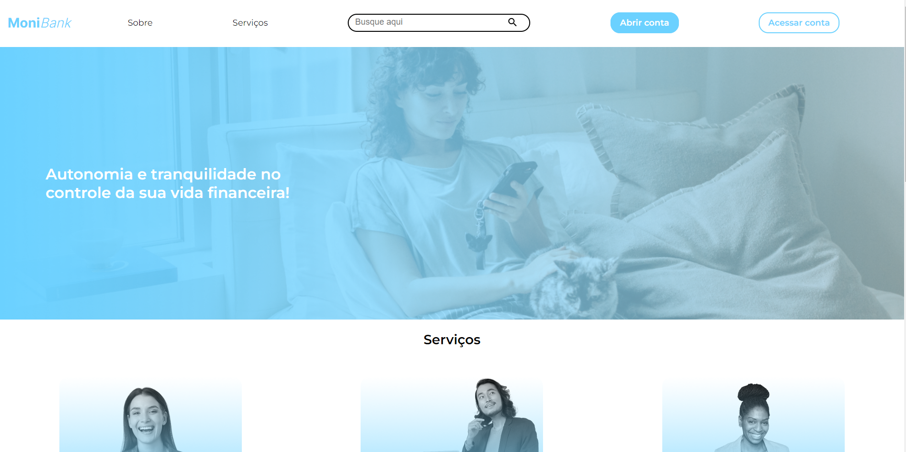
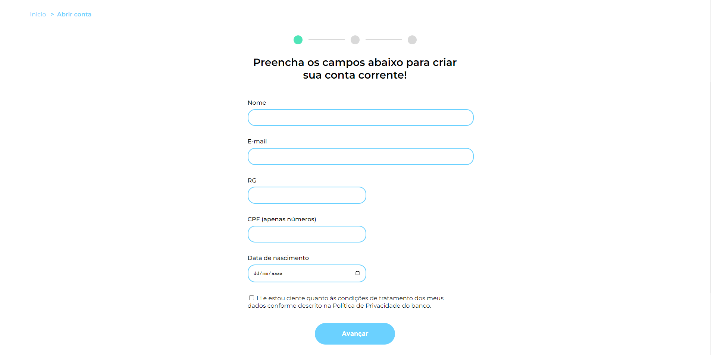
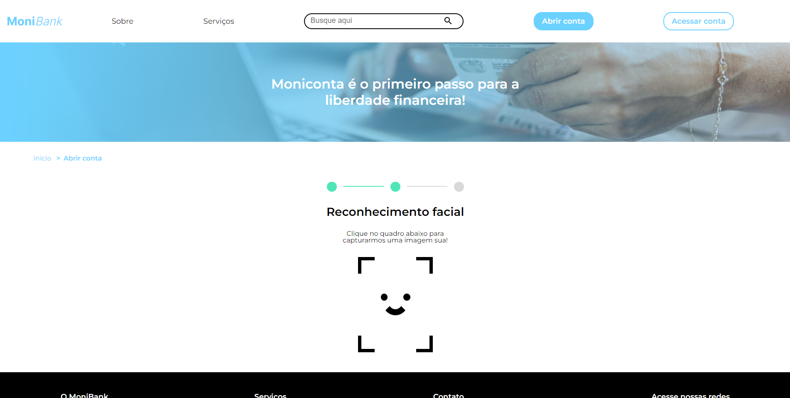
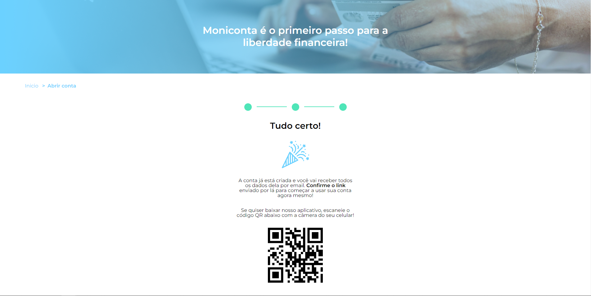

## Visão Geral

### O projeto

- Projeto de válidação de formulário para o Monibank

### Screenshot

### Links

- Live Site URL: [Monibank](https://monibank-lovat.vercel.app/)

## Meu processo

### Criado com

- JavaScript
- HTML e CSS fornecidos pelo curso

### O que eu aprendi

- Aprendi a validar formúlarios com JS

## Autor

- GitHub - [João Metzdorf](https://github.com/joaometzdorf)
